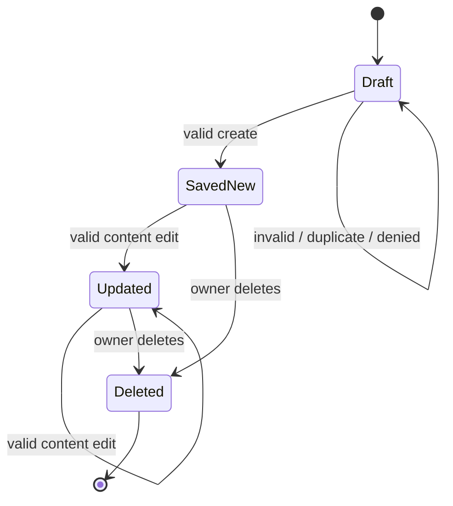
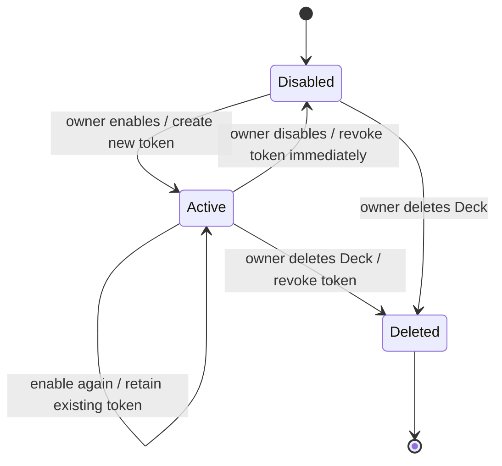

# Requirement Analysis Document: BR-02 Managing Document — Flashcard CRUD & Deck Sharing/Export

> **Project:** Language Learning Hub | **Module:** DOC — Document Management | **Analysis Date:** 2026-08-28  
> **Requirement Basis:** `BRD.md` v1.9 (BR-02) and `FRD-DOC.md` v0.5 (Group 3: FR-DOC-009–012; Group 5: FR-DOC-016–019)

---

## 1. Overview & Scope

- **Business requirement:** BR-02 — Managing Document.
- **Business purpose:** Let a learner maintain high-quality vocabulary material in the hierarchy Folder > Deck > Flashcard, safely expose a selected Deck for read-only public viewing, and take an offline Excel copy of its current Flashcards.
- **Actors:**
  - **Learner:** Authenticated Active owner of the Deck and its Flashcards.
  - **Public User:** Unauthenticated visitor who opens an active shared Deck URL; read-only.
  - **System:** Enforces session, account status, ownership, public-link state, and downstream consistency.
- **Module preconditions:** The system is operational; Learner session is valid; Learner account is Active; every Learner action is limited to resources they own. FR-DOC-017 is the sole public-access exception.

### In scope

- View the Flashcards of an owned Deck, including the empty-list state.
- Manually create, edit, and permanently delete an owned Flashcard.
- Validate Flashcard content, language placement guidance, duplicate terms, and the non-movable Deck association.
- Initialize learning state for a newly saved manual Flashcard and remove/invalidate it when deleted.
- Enable/disable a public share link for an owned Deck; view the active link as a Public User.
- Export the current contents of a non-empty owned Deck as `.xlsx`.
- RBAC, ownership checks, shared-link revocation, privacy of public data, and effects on LEARN/DASH.

### Out of scope

- Folder/Deck CRUD, AI generation and AI-preview save flows (Groups 1, 2, and 4).
- Creating a Deck without an existing Folder; moving Flashcards between Decks.
- Editing, exporting, importing/copying, learning from, or collaboratively editing a public shared Deck.
- Guaranteeing content accuracy; detailed token algorithm, endpoint/database design, and implementation-specific Excel generation.

---

## 2. User Stories & Business Requirements

### 2.1 User stories

- **US-DOC-01:** As a Learner, I want to view the Flashcards in my Deck so that I can manage the vocabulary I will study.
- **US-DOC-02:** As a Learner, I want to create and edit a Flashcard with complete vocabulary content so that my study material is correct and usable.
- **US-DOC-03:** As a Learner, I want to remove an obsolete Flashcard so that it is no longer studied, shared, exported, or counted in my progress.
- **US-DOC-04:** As a Learner, I want to enable or revoke a unique public link for one Deck so that I control read-only access to it.
- **US-DOC-05:** As a Public User, I want to view an active shared Deck without an account so that I can read its selected Flashcard content.
- **US-DOC-06:** As a Learner, I want to export my current Deck to Excel so that I can retain or print it offline.

### 2.2 Extracted business requirements

- **BR-02.1 — Ownership and hierarchy:** A Flashcard belongs to exactly one Deck. A Learner may only manage their own content.
- **BR-02.2 — Flashcard completeness:** `term`, `meaning`, and `exampleSentence` are mandatory, distinct content elements and must be non-empty after trimming before save.
- **BR-02.3 — Language content placement:** Japanese and Chinese content follow their respective placement rules; a phonetic reading that is inapplicable or unavailable does not block saving.
- **BR-02.4 — Flashcard uniqueness and immobility:** A normalized `term` is unique within one Deck; editing cannot move a Flashcard to another Deck.
- **BR-02.5 — Learning-data integrity:** A newly saved manual Flashcard is initialized as new/unreviewed. A deleted Flashcard must immediately cease to feed future learning, dashboard, shared-view, and export retrievals.
- **BR-02.6 — Controlled public sharing:** One owned Deck may have a unique, unguessable active URL. Public access is anonymous, read-only, and exposes only approved content.
- **BR-02.7 — Immediate revocation:** Disabling sharing or deleting the Deck makes its URL inactive. Re-enabling creates a new token; the old one remains invalid.
- **BR-02.8 — Non-mutating export:** An owned non-empty Deck can be exported in the exact `.xlsx` content format; sharing/export do not change Flashcards, SRS, sessions, or dashboard metrics.

---

## 3. Functional Requirements & Logic Flow

### 3.1 Functional requirements and acceptance baseline

| FR | Description | Acceptance baseline / exception coverage |
|---|---|---|
| **FR-DOC-009** | Learner views Flashcards in an owned Deck. | Show only current Flashcards; show **“This Deck has no Flashcards yet.”** for an empty Deck; deny cross-owner access; handle missing Deck as Not Found. |
| **FR-DOC-010** | Learner manually creates a Flashcard. | Save valid fields in target Deck; trim and reject blank/over-limit fields; reject normalized duplicate term in the same Deck; initialize `reviewLevel=0`, `nextReview=null`, `lastRecallRating=null`; deny missing/cross-owner Deck. |
| **FR-DOC-011** | Learner edits an owned Flashcard. | Update valid content only; preserve its Deck association and existing learning state; keep prior data if validation/duplicate check fails; reject a movement attempt, Not Found, or cross-owner request. |
| **FR-DOC-012** | Learner deletes an owned Flashcard. | Permanently delete without confirmation; remove/invalidate associated SRS state; no other Flashcard changes on failure; exclude the deleted item from downstream retrieval. |
| **FR-DOC-016** | Learner enables public sharing for an owned Deck. | Set sharing to enabled and create an active URL `/share/deck/{shareToken}`; if already enabled, show the existing URL; deny missing/cross-owner Deck. |
| **FR-DOC-017** | Public User views an active shared Deck. | Show only `deckName`, `term`, `meaning`, `exampleSentence` in view-only mode; return unavailable state for invalid, disabled, or deleted link; display empty state for an empty Deck; deny restricted actions. |
| **FR-DOC-018** | Learner disables public sharing. | Set sharing disabled and immediately revoke prior link; a refresh/next request from an open public page must be unavailable; re-enable creates a new token; deny cross-owner request. |
| **FR-DOC-019** | Learner exports an owned Deck. | Produce `.xlsx` only for a non-empty owned Deck; exact columns/order and UTC+7 filename; retain supported multiline content; deny public/cross-owner use; do not alter application data on export failure. |

### 3.2 Core logic flows and state transitions

#### Flashcard lifecycle

- **SavedNew state:** `reviewLevel = 0`, `nextReview = null`, `lastRecallRating = null`; this makes the Flashcard eligible for Study Today.
- **Edit invariant:** `flashcardDeckAssociation` does not change. Content edit alone does not recalculate learning state.
- **Deletion invariant:** The single delete has no confirmation. If already loaded in an active LEARN session, LEARN treats it as Not Found and skips it.

#### Sharing-link lifecycle

- An active link does not auto-expire.
- The token must be unique and unguessable, and must not reveal private identifiers in readable form.
- Public access validates token existence, active sharing status, and Deck existence on every next system request.

#### Export flow

1. Verify authenticated Active Learner and ownership of the selected Deck.
2. Verify that the Deck exists and contains at least one current Flashcard.
3. Retrieve current Flashcards only, create `.xlsx`, and provide the file.
4. Do not include SRS fields, owner email, internal IDs, sharing token, or dashboard metrics; do not modify application data.

---

## 4. Field Specifications & Data Constraints

| Field / output | Control or type | Required | Validation / constraint | Default / state | Dependencies / notes |
|---|---|---:|---|---|---|
| `term` | Multiline text input / text | Yes | Non-empty after trim; max 500 chars; line breaks allowed; normalized (trim, collapse internal spaces, case-insensitive where applicable) must be unique in the Deck. Japanese: original vocabulary + applicable Sino-Vietnamese. Chinese: original vocabulary only. | None | Shown in full on Flashcard front and shared view/export. |
| `meaning` | Multiline text input / text | Yes | Non-empty after trim; max 1,000 chars; line breaks allowed; must be conceptually separate from example. Japanese: applicable Hiragana then Vietnamese meaning. Chinese: Sino-Vietnamese, optional Pinyin, then Vietnamese meaning. | None | Absence of unavailable/inapplicable Hiragana or Pinyin does not block save. Shown on back/shared view/export. |
| `exampleSentence` | Multiline text input / text | Yes | Non-empty after trim; max 500 chars; line breaks allowed; target-language contextual sentence followed by Vietnamese translation. | None | Shown separately on back/shared view/export. |
| `flashcardDeckAssociation` | Immutable relationship | Yes | Exactly one Deck; changing it is out of MVP scope. | Target Deck at create | Must remain unchanged on edit. |
| `reviewLevel` | Number | System | Initialized to `0` when manual Flashcard is saved. | `0` | Used by LEARN/DASH; no recalculation on content edit. |
| `nextReview` | Date/null | System | Initialized `null`; `null` means new/unreviewed. | `null` | Makes saved item eligible for Study Today. |
| `lastRecallRating` | Enum/null | System | Initialized `null`. | `null` | SRS data is removed/invalidated on deletion. |
| `sharingStatus` | Toggle / enum | System | `enabled` or `disabled`; only owner may change it. | `disabled` assumed for a new Deck; confirm in AMB-01 | Affects Public User access only. |
| `shareToken` | System-generated opaque token | Conditional | Unique, unguessable; no readable learner/deck/email/private data; not reused after revoke. | Created on enable | Technical algorithm intentionally unspecified. |
| `sharedDeckUrl` | Read-only URL | Conditional | `/share/deck/{shareToken}`; active only while sharing enabled and Deck exists. | Created on enable | Does not auto-expire. |
| `exportFile` | `.xlsx` download | Conditional | Only non-empty owned Deck. Filename `deck_<normalizedDeckName>_<YYYYMMDD>.xlsx`, UTC+7. | Generated on request | `normalizedDeckName`: lowercase, spaces to hyphens, unsafe characters removed/replaced. |
| Export columns | Ordered worksheet columns | Yes when export succeeds | Exact order: `No`, `Term`, `Meaning`, `Example Sentence`; preserve multiline where supported. | N/A | Excludes private/system/SRS information. |

---

## 5. RBAC & Downstream Impacts

### 5.1 Permission matrix

| Action / resource | Learner — owner | Learner — non-owner | Public User | Admin |
|---|---:|---:|---:|---:|
| View Flashcards in a Deck | Allowed | Denied | Denied except active shared view | Denied |
| Create / edit / delete Flashcard | Allowed | Denied | Denied | Denied |
| Enable / disable sharing | Allowed | Denied | Denied | Denied |
| View active shared link | May view | May view as public content only | Allowed, view-only | May view as public content only |
| Export Deck | Allowed for non-empty Deck | Denied | Denied | Denied |
| View owner/SRS/dashboard/internal data through share page | N/A to public page | N/A | Denied / not exposed | N/A |

> UI hiding is not authorization. Backend/API must enforce role, Active account status, ownership, and token state. A deactivated Learner cannot continue authenticated actions.

### 5.2 Downstream impacts and dependencies

| Change/event | Affected area | Required impact |
|---|---|---|
| Manual Flashcard saved | LEARN, DASH | Initialize new learning state; item becomes eligible for Study Today. |
| Flashcard content edited | DOC, LEARN/DASH | Content updates; Deck association and learning state remain unchanged. |
| Flashcard deleted | LEARN, DASH, public view, export | Immediately exclude it from future Study Today/Freedom Mode queues, active/future LEARN retrieval, dashboard source calculations, shared Deck retrieval, and export. |
| Deck sharing enabled/disabled | Public shared-view access | Only changes public access; does not change learning eligibility, SRS, DASH, or the owner's Freedom Mode availability. |
| Deck deleted | Shared link | Invalidate its public URL. |
| Deck exported | DOC, LEARN, DASH, sharing | Read-only operation; no state/content/metrics/sharing change. |

---

## 6. Traceability Matrix

| BR / rule | Functional requirement | Acceptance criteria covered | Verification focus |
|---|---|---|---|
| BR-02.1; BR-DOC-008 | FR-DOC-009 | AC-DOC-009-01 to 03 | Owned list, empty state, ownership. |
| BR-02.2, BR-02.3; BR-DOC-008, 009, 015, 020 | FR-DOC-010 | AC-DOC-010-01 to 05 | Required/boundary fields, normalized duplicate, language placement, initial SRS state, RBAC. |
| BR-02.2–02.4; BR-DOC-008, 009, 010, 015 | FR-DOC-011 | AC-DOC-011-01 to 06 | Update integrity, validation rollback, duplicate exclusion, immutable Deck relationship, RBAC. |
| BR-02.5; BR-DOC-011, 020 | FR-DOC-012 | AC-DOC-012-01 to 04 | Permanent deletion and downstream exclusion. |
| BR-02.6–02.8; BR-DOC-016–018, 021 | FR-DOC-016 | AC-DOC-016-01 to 04 | Token/URL activation, idempotency, ownership. |
| BR-02.6; BR-DOC-016–018, 021 | FR-DOC-017 | AC-DOC-017-01 to 06 | Active-token validation, public data minimization, view-only enforcement. |
| BR-02.7; BR-DOC-016–018, 021 | FR-DOC-018 | AC-DOC-018-01 to 05 | Immediate revocation, refresh behavior, old-token non-reuse. |
| BR-02.8; BR-DOC-019, 021 | FR-DOC-019 | AC-DOC-019-01 to 07 | File type/content/order/name, empty/unauthorized/error paths, non-mutation. |

---

## 7. Ambiguities & Testing Risks

### 7.1 Ambiguities requiring PO/BA clarification

| ID | Unclear point | Impact if unresolved | Severity | Clarification question |
|---|---|---|---|---|
| AMB-01 | The default `sharingStatus` for a newly created Deck is not explicitly stated in the selected FRs. | UI/API could expose a Deck unintentionally or display inconsistent controls. | High | Must every newly created Deck initialize as `disabled`? |
| AMB-02 | “Case-insensitively where applicable” for duplicate `term` does not specify Unicode normalization, Japanese/Chinese behavior, or full-width versus half-width characters. | Duplicate prevention may differ by client/database and allow visually equivalent terms. | High | Which Unicode/width normalization rules apply to `term` comparison for Japanese and Chinese? |
| AMB-03 | Required reading content is described as “when applicable/available,” but there is no authoritative rule or source that determines applicability/availability. | Inconsistent validation/review of Japanese Hiragana, Sino-Vietnamese, and Chinese Pinyin. | Medium | Is this always advisory/manual review, or must the system validate a defined language/script condition? |
| AMB-04 | A public page open before revocation is denied on next refresh/request, but cache-control/offline/browser-back behavior is not specified. | Previously rendered sensitive content may remain visible locally after revoke. | Medium | What cache headers and expected behavior are required for browser Back, cached pages, or offline mode after sharing is disabled? |
| AMB-05 | Export `No` numbering behavior and Flashcard row ordering are not specified. | File ordering can be nondeterministic and difficult to verify/reconcile. | Medium | Should `No` begin at 1, and what stable sort order must export use (creation time, list order, term, or another rule)? |
| AMB-06 | “Preserved where supported by `.xlsx`” does not define acceptance for line breaks, wrapping, encoding, or Excel compatibility. | Different exporters/viewers may yield inconsistent formatting. | Medium | What concrete multiline acceptance is required (cell newline, wrap-text styling, target spreadsheet applications)? |
| AMB-07 | Generic export failure is required, but retryability, partial-file cleanup, download timeout, and audit/logging expectations are absent. | Users may receive a corrupted/partial file or duplicate downloads. | Medium | Must failed exports remove partial files and permit retry immediately; are error codes/logging required? |
| AMB-08 | “Internal IDs where avoidable at functional level” does not provide an exact public response schema. | Public endpoint/UI may accidentally disclose IDs or metadata. | High | Please approve an explicit allow-list schema for the public link response, including whether deck/flashcard IDs are ever exposed. |

### 7.2 Testing risks

| ID | Risk | Detailed description | Mitigation |
|---|---|---|---|
| RISK-01 | Broken ownership enforcement | Direct URL/API access could create, edit, delete, share, or export another Learner’s resources. | Run authorization tests for each action at UI and API layers using two Learners, invalid session, deactivated account, and Admin session. |
| RISK-02 | Stale share-link access | Revocation or Deck deletion may leave old tokens active due to cache, replicas, or token reuse. | Verify old URL on fresh request/refresh after disable/delete and re-enable; assert new token differs and response contains no Deck data. |
| RISK-03 | Public-data leakage | Shared view could expose owner email, IDs, SRS/dashboard values, hidden controls, or privileged API data. | Contract-test an allow-list of public fields and test direct restricted endpoints/actions. |
| RISK-04 | Data-integrity drift after deletion | Deleted Flashcards could remain in LEARN queues, DASH calculations, share view, or export. | Run cross-module retrieval checks after deletion, including an active session containing the item. |
| RISK-05 | Duplicate bypass | Whitespace, case, Unicode, or concurrent requests can bypass per-Deck unique-term logic. | Test normalized variants and concurrent create/edit submissions; back enforcement with atomic uniqueness strategy. |
| RISK-06 | Export privacy/correctness defects | Export could include unintended columns, wrong filename date/time zone, wrong order, damaged multiline values, or empty output. | Inspect generated workbook contents/properties under UTC+7 boundaries, special characters, line breaks, and empty/non-owner/public scenarios. |
| RISK-07 | XSS/content rendering | User-entered multilingual text may be rendered in lists or public pages without safe encoding. | Security-test HTML/script-like strings in all three fields; verify safe rendering and no script execution. |

---

## 8. QA Acceptance Checklist

- [ ] Owned Deck list exposes only its current Flashcards and has a distinct empty state.
- [ ] Manual create/edit validates each required field, limits, normalized duplicate term, and preserves the Deck association.
- [ ] Saved manual Flashcards receive the defined initial learning state.
- [ ] Deletion is permanent, requires no confirmation, and removes all specified downstream availability.
- [ ] Sharing issues an active opaque URL only for the owner and reuses it while sharing remains enabled.
- [ ] Public view is anonymous, read-only, data-minimized, and unavailable for invalid/disabled/deleted links.
- [ ] Disable revokes the prior URL immediately; re-enable uses a different token.
- [ ] Export is owner-only, non-empty only, `.xlsx`, ordered correctly, privacy-safe, UTC+7 named, and non-mutating.
- [ ] All ownership, session, Active-account, and restricted-action checks are enforced server-side.

---

*This artifact intentionally analyzes requirements and verification baseline only; it does not contain executable or step-by-step test cases.*
