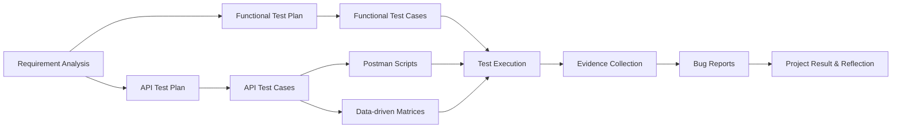

# Language Learning Hub — Functional & API Testing Project

A **personal QA portfolio project** for the **Language Learning Hub (LLH)** application, focused on practicing an end-to-end testing workflow from requirement analysis and test planning to functional/API execution, test-data design, evidence collection, and defect reporting.

This repository contains **testing artifacts and execution evidence**, not the application's source code.

## Project at a glance

| Area | Details |
|---|---|
| Project type | Personal QA / Software Testing Portfolio Project |
| Application | Language Learning Hub |
| Main scope | Flashcard CRUD, AI Generation, Sharing, Public Access, Export |
| Testing | Functional Testing + API Testing |
| API tool | Postman + Collection Runner |
| Scripting | JavaScript (`pm.*`) |
| Test design | Positive, Negative, BVA, EP, State Transition, RBAC/BOLA, Data-driven Testing |
| Evidence | Test execution screenshots, screenshots/videos for defects, consolidated bug reports |

## Portfolio highlights

- Requirement analysis and separate **Functional** and **API Test Plans**.
- Functional and API test-case worksheets.
- Dependency-aware execution design for **47 API test cases**.
- Reusable Postman pre-request and post-response scripts.
- **4 CSV-driven validation matrices** for bulk API validation.
- Explicit fixture lifecycle, state verification, restoration, and cleanup strategy.
- Dedicated **API test execution evidence** covering setup and six major API workflow groups.
- Separate **Functional Bug Report** and **API Bug Report**, supported by evidence.
- A final personal project report covering results, learning outcomes, challenges, and current limitations.

> **Project summary:** [`BÁO CÁO KẾT QUẢ PROJECT.pdf`](B%C3%81O%20C%C3%81O%20K%E1%BA%BET%20QU%E1%BA%A2%20PROJECT.pdf)

## Scope under test

The project focuses on the LLH **DOC / Flashcard** workflows and related APIs:

- Flashcard creation, listing, editing, and deletion;
- Japanese and Chinese Flashcard data;
- AI-generated Flashcard Preview;
- saving AI-generated Flashcards to existing or new Decks;
- duplicate handling and atomic-save behavior;
- Deck sharing lifecycle;
- anonymous/public shared-Deck access;
- XLSX Deck export;
- authentication and authorization scenarios;
- ownership/RBAC and BOLA-style access-control cases;
- field validation and boundary-value testing;
- state consistency, fixture management, and cleanup after mutations.

## Testing workflow



The goal is to keep the testing process **traceable and evidence-based**, rather than treating individual checks as isolated test activities.

## API testing design

The API suite defines an optimized run flow for **47 test cases**. The order is based on resource dependency, fixture stability, recoverability, and cleanup instead of simply following worksheet row order.

The execution flow covers:

- read-only and authentication checks on stable fixtures;
- denied mutations and ownership/RBAC verification;
- positive create/update operations with restoration;
- isolated validation matrices using disposable resources;
- Flashcard create → delete → omission lifecycle;
- AI Preview and atomic-save workflows;
- partial AI generation → selected-save handoff;
- sharing enable → public access → disable → re-enable state transitions;
- XLSX export verification;
- final cleanup and residual-state reconciliation.

See: [`API TESTCASE RUN FLOW.md`](DOCUMENTS/API%20DOCUMENTS/API%20TESTCASE%20RUN%20FLOW.md)

## Postman implementation

The project uses reusable scripts instead of duplicating assertion logic across every request.

| Script area | Responsibility |
|---|---|
| Common setup | Generate and preserve run-level identifiers |
| JSON assertions | Validate status, envelope, error code, and safe error responses |
| Fixture setup | Capture resource IDs and reusable parent resources |
| Flashcard assertions | Verify create/update results and lifecycle handoffs |
| List assertions | Verify list shape, counts, and deleted-resource omission |
| Delete assertions | Validate deletion and lifecycle transitions |
| AI Preview | Verify generated/failed input partitions |
| AI Save | Verify saved batches and capture new resource IDs |
| Sharing | Validate state transitions and share-token lifecycle |
| Public access | Validate anonymous projection and privacy boundaries |
| Matrix testing | Load row-specific payloads and expected outcomes |
| Export | Validate the binary XLSX HTTP contract |

See: [`API TESTING SCRIPTS.md`](DOCUMENTS/API%20DOCUMENTS/API%20TESTING%20SCRIPTS.md)

## Data-driven API validation

Postman Collection Runner is used with CSV files for repeated validation/boundary scenarios:

- [`TD-MATRIX-010.runner.csv`](TEST%20DATA,%20BULK%20VALIDATION%20API/TD-MATRIX-010.runner.csv) — Flashcard Create validation;
- [`TD-MATRIX-012.runner.csv`](TEST%20DATA,%20BULK%20VALIDATION%20API/TD-MATRIX-012.runner.csv) — Flashcard Update validation;
- [`TD-MATRIX-014.runner.csv`](TEST%20DATA,%20BULK%20VALIDATION%20API/TD-MATRIX-014.runner.csv) — AI Preview validation;
- [`TD-MATRIX-015.runner.csv`](TEST%20DATA,%20BULK%20VALIDATION%20API/TD-MATRIX-015.runner.csv) — AI Save validation.

This keeps validation coverage scalable while preserving row-level inputs and expected outcomes.

## API test execution evidence

The [`API TEST EXECUTION`](API%20TEST%20EXECUTION) folder documents the physical Postman setup and the main executed workflow groups.

### Setup evidence

- [`Environment setup`](API%20TEST%20EXECUTION/Environement%20setup.png)
- [`Collection setup`](API%20TEST%20EXECUTION/Collection%20setup.png)
- [`Collection variables`](API%20TEST%20EXECUTION/Collection's%20variable.png)

### Execution groups

1. [`Manual Flashcard Lifecycle`](API%20TEST%20EXECUTION/01%20-%20Manual%20Flashcard%20Lifecycle.png)
2. [`AI Preview & Atomic Save`](API%20TEST%20EXECUTION/02%20-%20AI%20Preview%20%26%20Atomic%20Save.png)
3. [`Sharing Account A Workflow`](API%20TEST%20EXECUTION/03%20-%20Sharing%20account%20A%20Workflow.png)
4. [`Public Shared Deck`](API%20TEST%20EXECUTION/04%20-%20Public%20Shared%20Deck.png)
5. [`Export`](API%20TEST%20EXECUTION/05%20-%20Export.png)
6. [`Authorization & RBAC`](API%20TEST%20EXECUTION/06%20-%20Authorization%20%26%20RBAC.png)

## Defect reporting

Functional and API findings are kept separately so the evidence and reporting context remain clear.

### Functional defects

The functional evidence set includes issues around:

- line-break handling;
- silent truncation of overlength fields;
- language mismatch during AI generation;
- stale duplicate checks;
- saving against deleted resources;
- export filename behavior;
- oversized AI input;
- duplicate-term editing behavior.

See:

- [`FUNCTIONAL BUG REPORTS.pdf`](BUG%20REPORTS/FUNCTIONAL%20BUG%20REPORTS.pdf)
- [`Functional testing evidence`](BUG%20REPORTS/EVIDENCES/Functional%20testing)

### API defects

The repository now also contains a dedicated API defect report and API-level evidence, including a duplicate-term update behavior discovered during API testing.

See:

- [`API BUG REPORT.pdf`](BUG%20REPORTS/API%20BUG%20REPORT.pdf)
- [`API testing evidence`](BUG%20REPORTS/EVIDENCES/API%20testing)

## Repository structure

```text
.
├── README.md
├── BÁO CÁO KẾT QUẢ PROJECT.pdf
│
├── API TEST EXECUTION/
│   ├── Environement setup.png
│   ├── Collection setup.png
│   ├── Collection's variable.png
│   ├── 01 - Manual Flashcard Lifecycle.png
│   ├── 02 - AI Preview & Atomic Save.png
│   ├── 03 - Sharing account A Workflow.png
│   ├── 04 - Public Shared Deck.png
│   ├── 05 - Export.png
│   └── 06 - Authorization & RBAC.png
│
├── BUG REPORTS/
│   ├── FUNCTIONAL BUG REPORTS.pdf
│   ├── API BUG REPORT.pdf
│   └── EVIDENCES/
│       ├── Functional testing/
│       └── API testing/
│
├── DOCUMENTS/
│   ├── REQUIREMENT ANALYSIS.pdf
│   ├── FUNCTIONAL TESTING DOCUMENT/
│   │   └── FUNCTIONAL TEST PLAN.pdf
│   └── API DOCUMENTS/
│       ├── POSTMAN API TEST PLAN.pdf
│       ├── API TESTCASE RUN FLOW.md
│       └── API TESTING SCRIPTS.md
│
├── TEST DATA, BULK VALIDATION API/
│   ├── TD-MATRIX-010.runner.csv
│   ├── TD-MATRIX-012.runner.csv
│   ├── TD-MATRIX-014.runner.csv
│   └── TD-MATRIX-015.runner.csv
│
└── WORKSHEET TESTING/
    ├── FUNTIONAL TESTING WORKSHEET.pdf
    └── API TESTING WORKSHEET.pdf
```

## Main artifacts

| Artifact | Purpose |
|---|---|
| [`BÁO CÁO KẾT QUẢ PROJECT.pdf`](B%C3%81O%20C%C3%81O%20K%E1%BA%BET%20QU%E1%BA%A2%20PROJECT.pdf) | Final project results, learning reflection, challenges, and limitations |
| [`REQUIREMENT ANALYSIS.pdf`](DOCUMENTS/REQUIREMENT%20ANALYSIS.pdf) | Requirement decomposition and test-basis analysis |
| [`FUNCTIONAL TEST PLAN.pdf`](DOCUMENTS/FUNCTIONAL%20TESTING%20DOCUMENT/FUNCTIONAL%20TEST%20PLAN.pdf) | Functional testing strategy and scope |
| [`POSTMAN API TEST PLAN.pdf`](DOCUMENTS/API%20DOCUMENTS/POSTMAN%20API%20TEST%20PLAN.pdf) | API strategy, coverage, collection design, and data-driven approach |
| [`API TESTCASE RUN FLOW.md`](DOCUMENTS/API%20DOCUMENTS/API%20TESTCASE%20RUN%20FLOW.md) | Dependency-aware execution order for the API suite |
| [`API TESTING SCRIPTS.md`](DOCUMENTS/API%20DOCUMENTS/API%20TESTING%20SCRIPTS.md) | Postman script inventory, placement, assertions, variables, and handoffs |
| [`FUNTIONAL TESTING WORKSHEET.pdf`](WORKSHEET%20TESTING/FUNTIONAL%20TESTING%20WORKSHEET.pdf) | Functional test-case and execution worksheet |
| [`API TESTING WORKSHEET.pdf`](WORKSHEET%20TESTING/API%20TESTING%20WORKSHEET.pdf) | API test-case worksheet |
| [`API TEST EXECUTION/`](API%20TEST%20EXECUTION) | Postman environment/collection setup and execution evidence |
| [`FUNCTIONAL BUG REPORTS.pdf`](BUG%20REPORTS/FUNCTIONAL%20BUG%20REPORTS.pdf) | Consolidated functional defect reports |
| [`API BUG REPORT.pdf`](BUG%20REPORTS/API%20BUG%20REPORT.pdf) | Consolidated API defect report |

## Test design techniques demonstrated

- Equivalence Partitioning (EP)
- Boundary Value Analysis (BVA)
- Positive and Negative Testing
- CRUD / Resource Lifecycle Testing
- State-transition Testing
- Authorization and Ownership Testing
- RBAC / BOLA-oriented Access-control Testing
- Duplicate and Conflict Testing
- Data-driven Testing
- Error-response Validation
- Response-contract Assertions
- Test Dependency and Fixture Management
- Cleanup and State-restoration Strategies

## Tools and practices

- **Postman** — API request execution and scripting
- **Postman Collection Runner** — CSV-driven bulk validation
- **JavaScript (`pm.*`)** — reusable pre-request and post-response logic
- **Manual Functional Testing** — UI behavior and user-flow verification
- **Screenshot & Video Evidence** — reproducible defect evidence
- **PDF / Worksheets** — plans, cases, execution results, and reports
- **Git / GitHub** — version control and portfolio documentation

## What this project demonstrates

As a fresher-level portfolio project, this repository is intended to demonstrate that I can work across more than test execution alone. The project required me to:

- translate requirements into testable conditions and scope;
- create structured test plans and test cases;
- design positive, negative, boundary, permission, and state-based coverage;
- manage reusable test data and stateful API dependencies;
- create Postman assertions and data-driven execution flows;
- verify business state after mutations rather than relying only on HTTP status codes;
- collect execution evidence;
- distinguish expected behavior from observed behavior;
- document reproducible defects with supporting evidence;
- review my own limitations and identify directions for further learning.

## Current limitations

This remains a **personal learning project**, so the current scope intentionally does not represent a complete production QA strategy. Areas for future development include deeper database verification, broader non-functional testing, dedicated API/UI automation frameworks, CI-based regression execution, and wider environment/browser coverage.

---

**Author:** [giakhuedz2005-tech](https://github.com/giakhuedz2005-tech)  
**Focus:** Manual Testing · API Testing · Postman · Test Design · Data-driven Testing · Bug Reporting