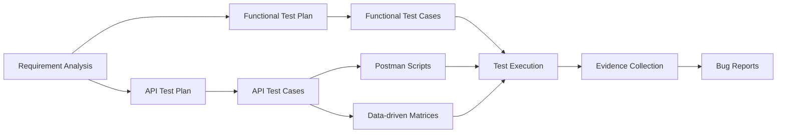

# Language Learning Hub — Functional & API Testing Project

A **personal QA testing project** for the **Language Learning Hub (LLH)** application, focused on building an end-to-end testing workflow from requirement analysis to functional testing, API testing, test-data design, execution evidence, and defect reporting.

This repository is intended to demonstrate practical **Manual QA / API Testing** skills rather than application source code.

## Project objectives

The main goals of this project are to:

- analyze requirements and identify testable business rules, risks, and edge cases;
- design structured functional and API test plans;
- create traceable test cases for positive, negative, boundary, authorization, and state-transition scenarios;
- implement reusable Postman scripts for API assertions and fixture management;
- use data-driven testing for bulk validation scenarios;
- control test dependencies, execution order, cleanup, and reusable fixtures;
- capture real execution evidence and document reproducible defects.

## Scope under test

The project focuses primarily on the LLH **DOC / Flashcard** workflows and related APIs, including:

- Flashcard creation, listing, editing, and deletion;
- Japanese and Chinese Flashcard data;
- AI-generated Flashcard preview;
- saving generated Flashcards to existing or new Decks;
- duplicate handling and atomic-save behavior;
- Deck sharing lifecycle and anonymous public access;
- XLSX Deck export;
- authentication and authorization scenarios;
- RBAC / ownership checks and BOLA-style access-control cases;
- field validation and boundary-value testing;
- state consistency and cleanup after mutations.

## Testing workflow



The workflow is designed so that test execution is based on documented requirements and reusable test artifacts rather than isolated ad-hoc checks.

## API testing highlights

The API suite currently defines an optimized execution flow for **47 API test cases**. Execution order is dependency-aware and prioritizes fixture stability, recoverability, state verification, and cleanup.

Key areas include:

- read-only and authentication checks before destructive operations;
- denied-mutation verification for unauthorized or foreign-resource access;
- positive create/update scenarios with immediate state restoration;
- isolated validation matrices using disposable fixtures;
- create → delete → omission lifecycle verification;
- AI Preview and AI Save workflows;
- partial-generation → selected-save handoff;
- sharing enable / public access / disable / re-enable state transitions;
- XLSX export contract verification;
- final cleanup and residual-state reconciliation.

See: [`API TESTCASE RUN FLOW.md`](DOCUMENTS/API%20DOCUMENTS/API%20TESTCASE%20RUN%20FLOW.md)

## Postman implementation

The repository includes a reusable Postman scripting design for manual sequential execution.

Examples of implemented script responsibilities:

| Script area | Responsibility |
|---|---|
| Common request setup | Generate and preserve run-level identifiers |
| JSON contract assertions | Validate HTTP status, JSON envelope, error codes, and safe error responses |
| Fixture setup | Capture resource IDs and reusable parent resources |
| Flashcard assertions | Validate create/update responses and lifecycle handoffs |
| List assertions | Validate result shape, counts, and deleted-resource omission |
| Delete assertions | Verify deletion responses and transition lifecycle variables |
| AI Preview | Validate generated/failed input partitions |
| AI Save | Validate atomic save results and capture created resource IDs |
| Sharing | Validate sharing state transitions and token lifecycle |
| Public access | Validate anonymous projection and privacy boundaries |
| Matrix testing | Materialize per-row request bodies and execute data-driven assertions |
| Export | Validate the XLSX HTTP response contract |

See: [`API TESTING SCRIPTS.md`](DOCUMENTS/API%20DOCUMENTS/API%20TESTING%20SCRIPTS.md)

## Data-driven validation

Bulk validation scenarios are executed with Postman Collection Runner data files.

Current matrices include:

- [`TD-MATRIX-010.runner.csv`](TEST%20DATA,%20BULK%20VALIDATION%20API/TD-MATRIX-010.runner.csv) — Flashcard creation validation;
- [`TD-MATRIX-012.runner.csv`](TEST%20DATA,%20BULK%20VALIDATION%20API/TD-MATRIX-012.runner.csv) — Flashcard update validation;
- [`TD-MATRIX-014.runner.csv`](TEST%20DATA,%20BULK%20VALIDATION%20API/TD-MATRIX-014.runner.csv) — AI Preview validation;
- [`TD-MATRIX-015.runner.csv`](TEST%20DATA,%20BULK%20VALIDATION%20API/TD-MATRIX-015.runner.csv) — AI Save validation.

This approach reduces duplicated requests while preserving row-level expected status, validation behavior, and traceability.

## Functional testing and defect reporting

The repository also contains functional testing artifacts and execution evidence.

Examples of observed defect areas include:

- line-break handling in Flashcard fields;
- silent truncation of overlength values;
- language mismatch in AI generation;
- stale duplicate-check behavior;
- validation of oversized AI input;
- export filename behavior;
- save behavior when referenced resources have been deleted.

Functional defect reports are supported by screenshots and video evidence stored under [`BUG REPORTS/EVIDENCES`](BUG%20REPORTS/EVIDENCES).

See the consolidated report: [`FUNCTIONAL BUG REPORTS.pdf`](BUG%20REPORTS/FUNCTIONAL%20BUG%20REPORTS.pdf)

## Repository structure

```text
.
├── README.md
├── BUG REPORTS/
│   ├── FUNCTIONAL BUG REPORTS.pdf
│   └── EVIDENCES/
│       └── Functional testing/
│           ├── screenshots
│           └── videos
│
├── DOCUMENTS/
│   ├── REQUIREMENT ANALYSIS.pdf
│   ├── FUNCTIONAL TESTING DOCUMENT/
│   │   └── FUNCTIONAL TEST PLAN.pdf
│   └── API DOCUMENTS/
│       ├── POSTMAN API TEST PLAN.pdf
│       ├── API TESTCASE RUN FLOW.md
│       └── API TESTING SCRIPTS.md
│
├── TEST DATA, BULK VALIDATION API/
│   ├── TD-MATRIX-010.runner.csv
│   ├── TD-MATRIX-012.runner.csv
│   ├── TD-MATRIX-014.runner.csv
│   └── TD-MATRIX-015.runner.csv
│
└── WORKSHEET TESTING/
    ├── FUNTIONAL TESTING WORKSHEET.pdf
    └── API TESTING WORKSHEET.pdf
```

## Main artifacts

| Artifact | Purpose |
|---|---|
| [`REQUIREMENT ANALYSIS.pdf`](DOCUMENTS/REQUIREMENT%20ANALYSIS.pdf) | Requirement decomposition and test-basis analysis |
| [`FUNCTIONAL TEST PLAN.pdf`](DOCUMENTS/FUNCTIONAL%20TESTING%20DOCUMENT/FUNCTIONAL%20TEST%20PLAN.pdf) | Functional testing strategy and scope |
| [`POSTMAN API TEST PLAN.pdf`](DOCUMENTS/API%20DOCUMENTS/POSTMAN%20API%20TEST%20PLAN.pdf) | API testing strategy, coverage, and collection design |
| [`API TESTCASE RUN FLOW.md`](DOCUMENTS/API%20DOCUMENTS/API%20TESTCASE%20RUN%20FLOW.md) | Dependency-aware execution order for the API suite |
| [`API TESTING SCRIPTS.md`](DOCUMENTS/API%20DOCUMENTS/API%20TESTING%20SCRIPTS.md) | Postman script inventory, placement, variables, assertions, and handoffs |
| [`FUNTIONAL TESTING WORKSHEET.pdf`](WORKSHEET%20TESTING/FUNTIONAL%20TESTING%20WORKSHEET.pdf) | Functional test-case worksheet |
| [`API TESTING WORKSHEET.pdf`](WORKSHEET%20TESTING/API%20TESTING%20WORKSHEET.pdf) | API test-case worksheet |
| [`FUNCTIONAL BUG REPORTS.pdf`](BUG%20REPORTS/FUNCTIONAL%20BUG%20REPORTS.pdf) | Consolidated defect reports based on executed tests |

## Test design techniques demonstrated

The project applies or incorporates:

- Equivalence Partitioning;
- Boundary Value Analysis;
- positive and negative testing;
- CRUD and resource-lifecycle testing;
- state-transition testing;
- authorization / ownership testing;
- BOLA-oriented access-control testing;
- duplicate and conflict testing;
- data-driven testing;
- error-response validation;
- response-contract assertions;
- test dependency and fixture management;
- cleanup and state-restoration strategies.

## Tools and practices

- **Postman** — API request execution and scripting;
- **Postman Collection Runner** — CSV-driven bulk validation;
- **JavaScript (`pm.*`)** — pre-request and post-response assertions;
- **Manual functional testing** — UI behavior and user-flow verification;
- **PDF / worksheet documentation** — test planning, test cases, and reports;
- **Screenshot & video evidence** — reproducible defect evidence;
- **Git / GitHub** — version control and portfolio documentation.

## Example API execution model

The API tests use reusable fixtures and explicit lifecycle variables such as Deck, Folder, Flashcard, and sharing identifiers. A typical stateful flow looks like:

```text
Setup fixtures
    ↓
Capture baseline
    ↓
Execute request
    ↓
Assert HTTP + response contract
    ↓
Verify business state / authorization boundary
    ↓
Capture evidence
    ↓
Restore or clean up modified data
```

For destructive or failed mutations, the suite verifies that unexpected state changes do not contaminate subsequent cases.

## What this project demonstrates

From a QA portfolio perspective, this project demonstrates my ability to work across the testing lifecycle rather than only execute predefined test cases:

- translate requirements into a testable scope;
- create structured Test Plans and Test Cases;
- design positive, negative, boundary, and permission coverage;
- create and manage reusable test data;
- build Postman assertions and data-driven test workflows;
- manage stateful API dependencies and cleanup safely;
- collect execution evidence;
- distinguish expected behavior from actual behavior;
- write reproducible bug reports with supporting evidence.

## Notes

This is a **personal learning and portfolio project**. The repository contains testing artifacts and evidence created for practice and skill demonstration. It should not be interpreted as an official QA repository of the LLH product or its maintainers.

---

**Author:** [giakhuedz2005-tech](https://github.com/giakhuedz2005-tech)  
**Focus:** Manual Testing · API Testing · Postman · Test Design · Bug Reporting